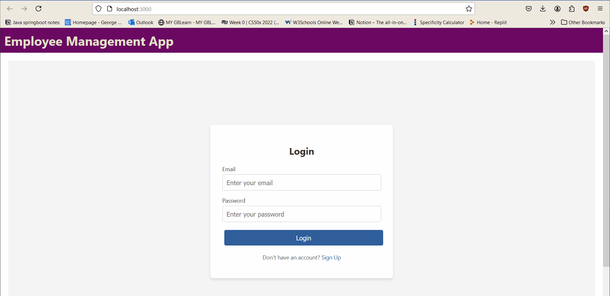
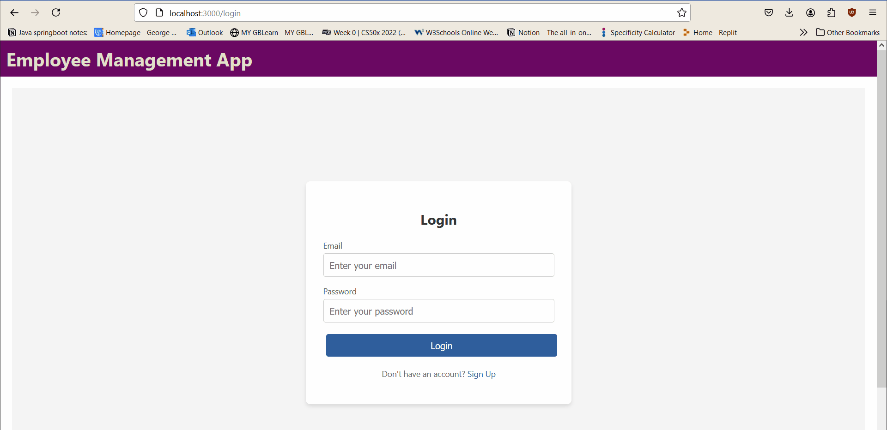
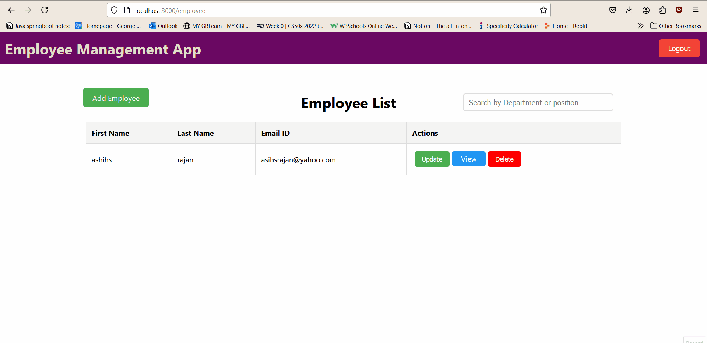

# Employee Management application

An Employee Management application built using MERN stack: Mongodb.Express.ReactJs.NodeJS

##  SignUp-Demo



##  SignIn-Demo




##  Create.Read.Update.Delete-Demo




## Features
- Lets users SignUp/SignIn, add employees
- Perform crud operations: add, view, update and delete employees


## Installation =  Backend

1. Clone the repository:
   ```bash
   git clone https://github.com/HardikKumariscoding/COMP3123-assign-2

2.   Install dependencies:

        cd backend
        npm install

3. Run the app locally:        

        node app.js

## Installation = Frontend

1. you only need to clone it once

2. Install dependencies:

        cd backend
        npm install

3. Run the app locally:

        npm start
        


4. Open the app in your browser:

    Visit http://localhost:3000 to see the employee Management app 


Technologies Used

    Mongo DB
    Express JS
    React JS
    Node JS